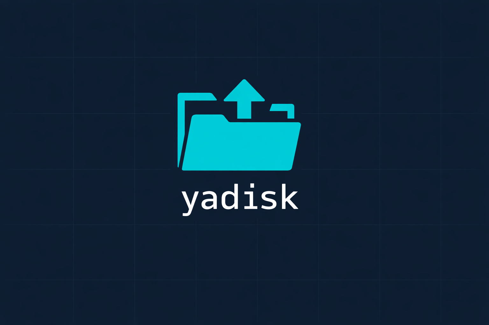

# yadisk



Yandex.Disk file management — programmatic API + CLI. Upload, download, list, copy, move, delete, publish files.

## Install

Requires [Bun](https://bun.sh/).

```bash
git clone https://github.com/vforsh/yadisk.git
cd yadisk
bun install
cd packages/cli && bun link
```

## Auth

### 1. Register an OAuth app

Create an app at [oauth.yandex.com/client/new](https://oauth.yandex.com/client/new/):

- **Platform** — Web services
- **Redirect URI** — `https://oauth.yandex.ru/verification_code`
- **Permissions** — expand **Yandex.Disk REST API**, select:
  - `cloud_api:disk.read` — read files/folders
  - `cloud_api:disk.write` — create/upload/modify/delete
  - `cloud_api:disk.info` — disk usage
  - `cloud_api:disk.app_folder` — app folder access

After saving, grab the **Client ID** from the [OAuth control panel](https://oauth.yandex.com/) — it's the alphanumeric string identifying your app.

### 2. Get a token

```bash
yadisk auth --client-id <your-client-id>
```

Opens an authorization URL → log in → grant access → copy token → paste back. Token saved to `~/.config/yadisk/token`.

### Token resolution

First match wins:

1. `--token <token>` flag
2. `YADISK_TOKEN` env var
3. `~/.config/yadisk/token` file

Tokens are long-lived (1+ year). If one expires, re-run `yadisk auth`.

## Usage

```bash
yadisk info                                  # disk usage/capacity
yadisk ls <path> [--limit N] [--sort X]      # list folder
yadisk stat <path>                           # file/folder metadata
yadisk mkdir <path>                          # create folder
yadisk upload <file> <dest> [--publish]      # upload + optional publish
yadisk download <path> [local-dest]          # download file
yadisk cp <from> <to> [--overwrite]          # copy
yadisk mv <from> <to> [--overwrite]          # move/rename
yadisk rm <path> [--permanently]             # delete
yadisk publish <path>                        # make public, print URL
yadisk unpublish <path>                      # remove public access
```

Global flags: `--json` (raw JSON output), `--token <token>` (override auth).

## Programmatic Usage

Import `@vforsh/yadisk` in your own scripts or packages:

```typescript
import { YaDiskClient, getToken } from "@vforsh/yadisk"

const token = getToken()
const client = new YaDiskClient(token)

// Upload and publish
const url = await client.getUploadUrl("/uploads/build.zip", true)
await client.upload(url, "./build.zip")
await client.publish("/uploads/build.zip")
const publicUrl = await client.getPublicUrl("/uploads/build.zip")

// List folder
const folder = await client.list("/uploads", { limit: 50, sort: "-modified" })

// Delete
await client.delete("/uploads/old-build.zip")
```

## Examples

```bash
# Upload and publish a build
yadisk upload ./build.zip /uploads/build.zip --publish

# List recent uploads
yadisk ls /uploads --limit 50 --sort -modified

# Download a file
yadisk download /uploads/build.zip ./build.zip

# Bulk upload
for f in dist/*.zip; do
  yadisk upload "$f" "/releases/$(basename "$f")" --publish
done
```
